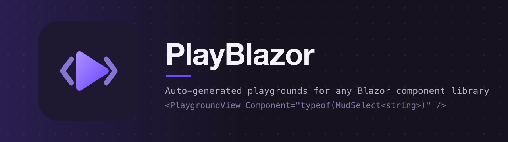

# PlayBlazor

> **Auto-generated playgrounds for any Blazor component library — point it at your components and every `[Parameter]` becomes an interactive control.**

<!-- Badges: Row 1 — Identity -->
[](https://github.com/Atypical-Consulting/PlayBlazor "Go to GitHub repo")
[](LICENSE)
[](https://dotnet.microsoft.com/en-us/download/dotnet/10.0)
[](https://github.com/Atypical-Consulting/PlayBlazor)
[](https://github.com/Atypical-Consulting/PlayBlazor)

<!-- Badges: Row 2 — Activity -->
[](https://github.com/Atypical-Consulting/PlayBlazor/releases/)
[](https://github.com/Atypical-Consulting/PlayBlazor/issues)
[](https://github.com/Atypical-Consulting/PlayBlazor/pulls)
[](https://github.com/Atypical-Consulting/PlayBlazor/commits/main)

<!-- Badges: Row 3 — Quality -->
[](https://github.com/Atypical-Consulting/PlayBlazor/actions/workflows/main.yml)

<!-- Badges: Row 4 — Distribution -->
[](https://www.nuget.org/packages/PlayBlazor)

---

## The problem

Storybook asks you to *write* stories: one file per component, hand-wired controls, kept in sync
by hand forever. For a component library with a hundred components and thousands of parameters,
that is a second codebase — and it rots the moment someone adds a parameter.

PlayBlazor asks you to write nothing. It reflects over your components, turns every public
`[Parameter]` into a typed control, and renders the specimen live next to the Razor markup that
would produce it.

```razor
@* One component, one line — in any docs page *@
<PlaygroundView Component="typeof(MudSelect<string>)" />

@* Or browse everything a library exposes *@
<PlaygroundExplorer Assemblies="@(new[] { typeof(MudButton).Assembly })" />
```

## What you get

- **Auto-generated controls** — bool → toggle, enum → select, numbers → numeric input, dates,
  times, colors, icons, CSV for collections, `RenderFragment` slots → editable sample text.
  Defaults come from instantiating the component once; XML doc summaries become tooltips.
- **A live Razor snippet** — the code panel always shows the markup matching the current
  configuration, generic closings and slot children included, ready to copy.
- **An event log** — every `EventCallback` is intercepted and logged with timestamp and payload,
  and two-way `XxxChanged` callbacks write back into the panel (no snap-back).
- **A dockable workspace** — Graph, Parameters, Razor and Signals panels dock bottom/right or
  float, resize, collapse, and persist their layout.
- **Permalinks** — the address bar *is* the permalink (`?pb-MudButton=…`); share by copying it.
- **Resilient by construction** — a component that throws is contained by an error boundary;
  one that cannot be instantiated is reported, never fatal.

The shell has **zero UI dependencies** — system fonts, scoped CSS, no JS beyond the workspace
module and `navigator.clipboard`. It imposes nothing on the host site.

See [the package README](src/PlayBlazor/README.md) for the full configuration API.

## Try it

**[atypical-consulting.github.io/PlayBlazor](https://atypical-consulting.github.io/PlayBlazor/)** — the demo runs in your browser, nothing to install.

Or locally:

```bash
dotnet run --project demo/PlayBlazor.DemoHost
```

The demo points PlayBlazor at MudBlazor's component set — 65 curated components on `/`, the full
dockable workspace on `/explorer`. MudBlazor is the **demo subject, not a dependency**: the
`PlayBlazor` package itself references nothing but `Microsoft.AspNetCore.Components.Web`.

## Repository layout

| Path | What it is |
|------|-----------|
| `src/PlayBlazor` | The shipped Razor class library (the `PlayBlazor` NuGet package). |
| `tests/PlayBlazor.UnitTests` | 220 bUnit/NUnit tests, plus `[Explicit]` diagnostic sweeps over a whole component library. |
| `demo/PlayBlazor.DemoHost` | Blazor WebAssembly showcase driving MudBlazor. |
| `docs/superpowers` | Design spec, milestone plans and the UX concept prototypes (A→G) that produced the current shell. |

## Building

```bash
dotnet build -c Release
dotnet test -c Release
```

Requires the .NET SDK pinned in `global.json`. Versions come from git tags via MinVer: tag `v0.1.0`
and the package builds as `0.1.0`; untagged builds are `-preview`.

## Status

v1 is complete and exercised: 220 tests green, and a browser sweep of 165 MudBlazor components
renders clean. Next up:

- **v2** — edit the snippet itself, parsed back into the controls (no arbitrary compilation).
- **v3** — full in-browser REPL (Roslyn).
- Multi-node composition graphs in a single bench, and a richer icon picker.

PlayBlazor was incubated inside a MudBlazor fork — that history is preserved here, which is why
the earliest commits describe paths under a MudBlazor tree.

## License

[MIT](LICENSE) — Copyright (c) 2026 Atypical Consulting SRL
